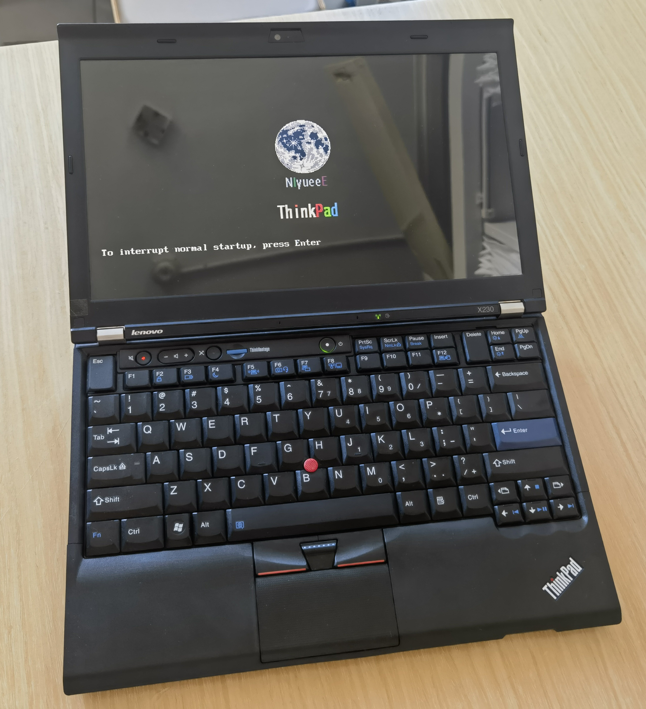

[阅读中文版本](./README.md)

# ThinkPad-Mod-Guide

This project integrates the programmer-free BIOS modding tool [**1vyrain**](https://github.com/n4ru/1vyrain) with the Embedded Controller (EC) modification tool [**thinkpad-ec**](https://github.com/hamishcoleman/thinkpad-ec). It aims to provide a clear and structured guide for ThinkPad users to unlock the following advanced features:

- **Advanced BIOS Menu & Whitelist Removal**: Unlock hidden BIOS settings and remove the hardware whitelist, allowing the use of any wireless network card. For a full list of features, please see the [1vyrain features list](https://github.com/n4ru/1vyrain#bios-mod-features).
- **Custom Boot Logo**: Replace the default startup animation with a custom image.
- **EC Modification**: Patch the Embedded Controller to enable support for the classic 7-row ThinkPad keyboard.

---

## Compatibility

Before proceeding, please ensure your device and its current BIOS version are compatible with the tools.

### BIOS Modding & Custom Boot Logo (1vyrain)

| Model | X230 | X230t | T430 | T430s | T530 | W530 |
| :--- | :--- | :--- | :--- | :--- | :--- | :--- |
| **Supported** | ✔️ | ✔️ | ✔️ | ✔️ | ✔️ | ✔️ |

*For the most up-to-date compatibility list, please refer to the [official 1vyrain documentation](https://github.com/n4ru/1vyrain#supported-systems).*

### EC Modification for Classic Keyboard (thinkpad-ec)

| Model | Compatible BIOS Version (EC Version) |
| :--- | :--- |
| **T430** | BIOS 2.81 (G1ETC1WW) / EC 1.13 (G1HT35WW) |
| **T430s** | BIOS 2.75 (G7ETB5WW) / EC 1.16 (G7HT39WW) |
| **T530, T530i** | BIOS 2.76 (G4ETB6WW) / EC 1.13 (G4HT39WW) |
| **W530** | BIOS 2.75 (G5ETB5WW) / EC 1.13 (G4HT39WW) |
| **X230** | BIOS 2.75 (G2ETB5WW) / EC 1.14 (G2HT35WW) |
| **X230t** | BIOS 2.73 (GCETB3WW) / EC 1.14 (GCHT25WW) |

> [!Important]
>
> If you intend to both unlock the BIOS and modify the EC, the custom BIOS you flash must exactly match one of the versions listed in the table above. The recommended method is to use 1vyrain's "flash custom binary" feature to flash an official BIOS image that meets the EC patch requirements.

---

## Guides

- **For BIOS Unlocking Only**: [View Tutorial](./doc/patch_BIOS.en.md)
- **For BIOS Unlocking and Custom Logo, EC Modding, and Classic Keyboard Installation**: [View Tutorial](./doc/patch_BIOS_and_EC.en.md)

---

## Acknowledgements

This project is primarily a documentation and workflow consolidation effort to provide the community with a clearer set of instructions. The procedures described here have been personally tested on a ThinkPad X230. They may not work for other models, so please proceed with caution and at your own risk.

Special thanks to the creators of these outstanding projects, without whom this guide would not be possible:

- **[1vyrain](https://github.com/n4ru/1vyrain)** by n4ru
- **[thinkpad-ec](https://github.com/hamishcoleman/thinkpad-ec)** by hamishcoleman
- **[thinkpad-firmware-patches](https://github.com/digmorepaka/thinkpad-firmware-patches/)** by digmorepaka