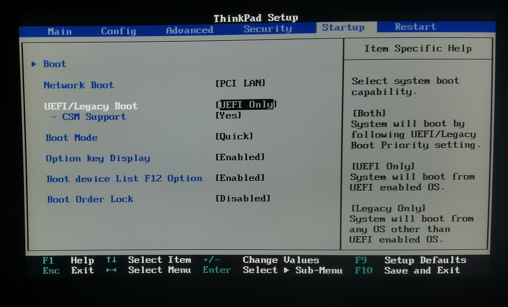
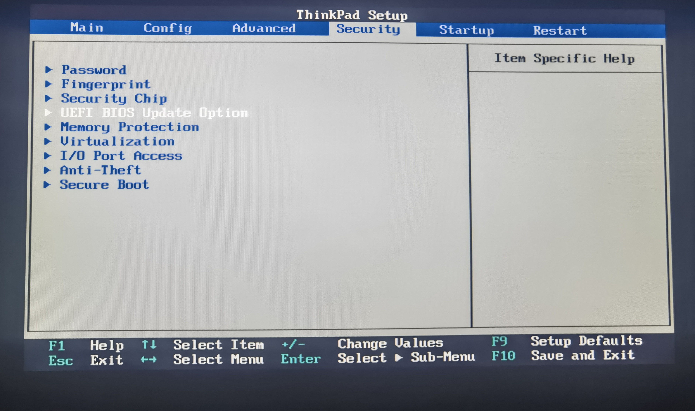
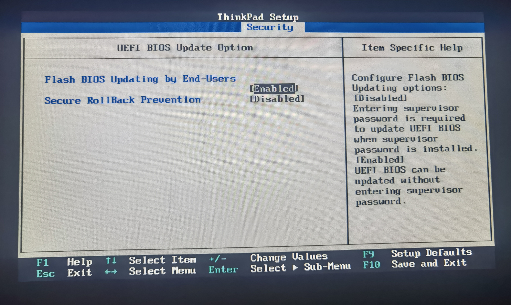
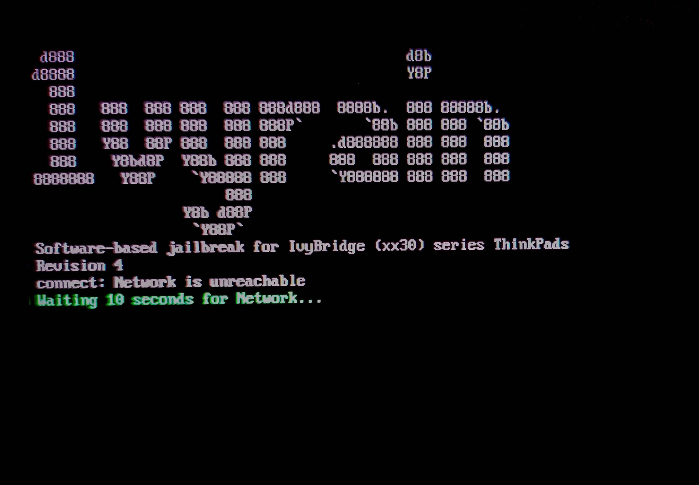

[阅读中文版本](./patch_BIOS.md)

# Guide: Flashing the Unlocked BIOS Only

This guide provides a detailed walkthrough for unlocking your ThinkPad's BIOS using the [1vyrain](https://github.com/n4ru/1vyrain) utility. The process closely follows the official documentation but is presented here with additional clarifications and images to ensure a smooth experience.

> [!IMPORTANT]
> This document covers the BIOS unlocking procedure only. If you wish to unlock the BIOS and patch the EC for classic keyboard support, please follow the [BIOS Unlock and EC Patch Guide](./patch_BIOS_and_EC.en.md) instead.

---

## 1. Preparation

Before you begin, please ensure you have the following ready:

1. **A USB Flash Drive**: A capacity of 4GB or greater is recommended.
2. **Operating Environment**: A computer running a 64-bit version of Windows.
3.  **IVprep Downgrade Tool**: The official BIOS downgrade utility provided by the [1vyrain](https://github.com/n4ru/1vyrain) project.
    -   You can obtain it by cloning the repository: `git clone https://github.com/n4ru/IVprep.git`
    -   Alternatively, download the ZIP archive from the GitHub page and extract it.
    -   For convenience, a copy is also included in this project, which you can [click here](../assets/n4ru-IVprep).
4.  **BIOS/UEFI Configuration**: Reboot your computer and enter the BIOS/UEFI setup utility to confirm the following settings:
    -   **Boot Mode**: Must be set to `UEFI Only`.
        -   Path: `Startup -> UEFI/Legacy Boot -> UEFI Only`
        -   
    -   **Firmware Rollback and Update Permissions**: Ensure that BIOS updates by users are enabled and that secure rollback prevention is disabled.
        -   Path: `Security -> UEFI BIOS Update Option`
        -   Set `Flash BIOS Updating by End-Users` to `Enabled`.
        -   Set `Secure RollBack Prevention` to `Disabled`.
        -   
        -   
5.  **Create 1vyrain Bootable Media**:
    - Download the [1vyrain ISO image](https://drive.google.com/file/d/1yusq98ja6NmI4G4txKVueFqY_ZEwaZvO/view) (or my [backup](../assets/n4ru-1vyrian_iso/)).
    - Use a tool like [Rufus](https://rufus.ie/downloads/) to write the ISO to your USB drive.
    - > [!Caution]
      >
      > **This process will erase all data on the USB drive. Back up your files beforehand.**
    -   **Rufus Instructions**:
        
        1.  Select your USB drive under "Device".
        2.  Click "SELECT" and open the `1vyrain.iso` file you downloaded.
        3.  Leave all other options at their default values.
        4.  Click "START". When the "ISOHybrid image detected" prompt appears, choose **Write in DD Image mode**.
        5.  Wait for the process to complete, then eject the USB drive.
        -   

---

## 2. Flashing Process

### Step 1: Downgrade the BIOS

1.  Boot into your Windows system.
2.  Navigate to the `IVprep` folder you prepared earlier.
3.  Right-click on `downgrade.bat` and select "Run as administrator".
4.  Ensure your laptop is connected to a power source and follow the on-screen instructions. The computer will restart automatically to perform the downgrade.
5.  After the process is complete, re-enter the BIOS/UEFI setup to verify that the BIOS version has been successfully downgraded. Once confirmed, proceed to the next step.

### Step 2: Flash the Unlocked BIOS

1.  Insert the 1vyrain bootable USB drive you created into the computer.
2.  Reboot the system and press the **F12** key during startup to open the boot menu. Select your USB drive to boot from it.
    -   *Note: Ensure the `Startup -> Boot device List F12 Option` is set to `Enabled` in the BIOS setup.*
3.  After successfully booting from the USB drive, you will be greeted by the 1vyrain main screen.
    -   
4.  At the options menu, type `1` and press Enter to select "Flash patched BIOS".
    -   
5.  The flashing process will now begin automatically. Please wait patiently for it to finish. The system will reboot and enter the BIOS/UEFI setup on its own.
6.  Success! If you see a new **`Advanced`** tab in the main menu bar, your BIOS has been successfully unlocked.
    -   

---

## 3. Key Features Unlocked

-   **CPU Overclocking**: Enables overclocking for Ivy Bridge CPUs in the 35xx, 37xx, 38xx, and 39xx series.
-   **Hardware Whitelist Removal**: Disables the WLAN/WWAN whitelist, allowing you to install and use any compatible wireless card.
-   **Advanced Menu**: Unlocks the full advanced BIOS menu, giving you access to in-depth settings like custom fan curves, TDP adjustments, and more.
-   **Intel ME Management**: Provides the option to apply a "soft temporary disable" to the Intel Management Engine (ME) via the advanced menu.

---

*Some images in this guide were sourced from [this article](https://zhuanlan.zhihu.com/p/158003472).*
