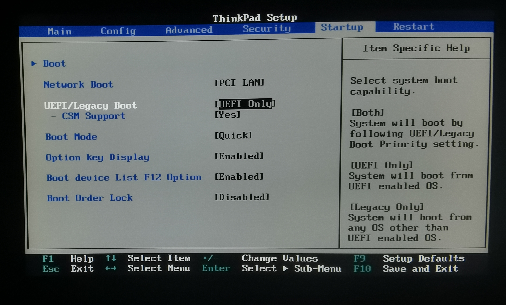
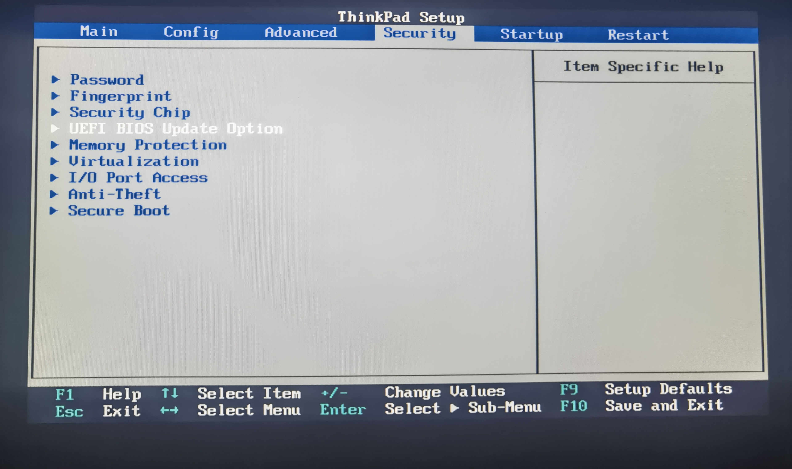
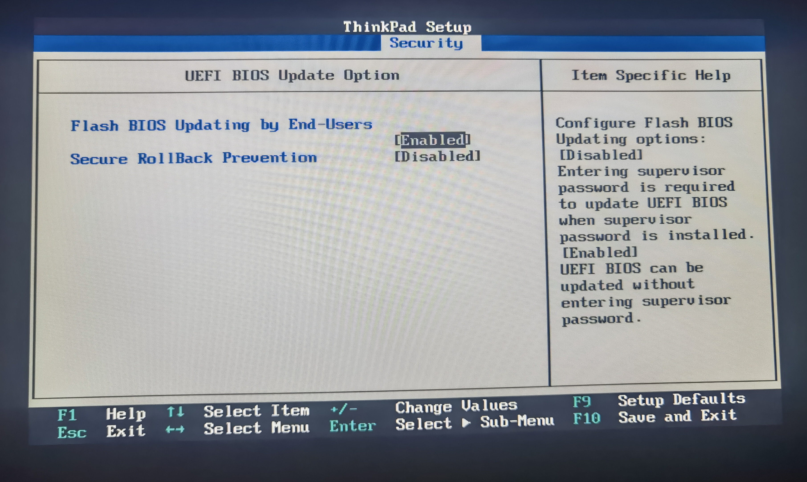
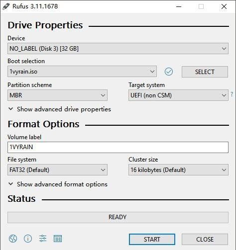
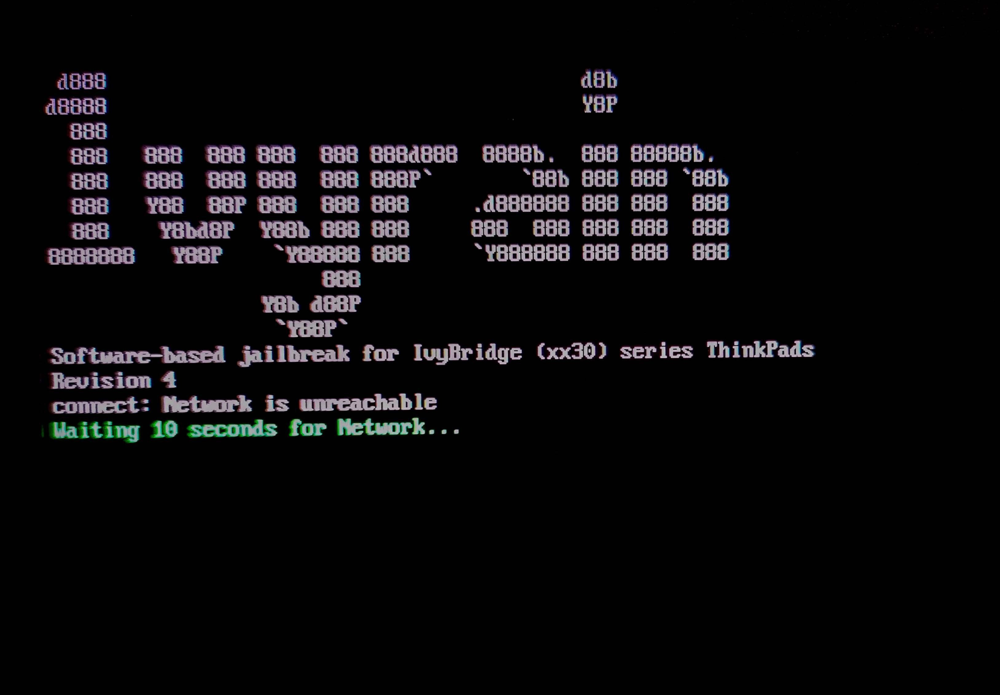
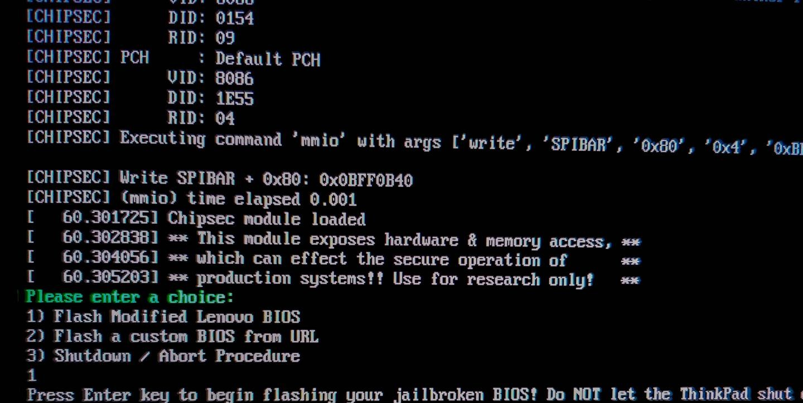
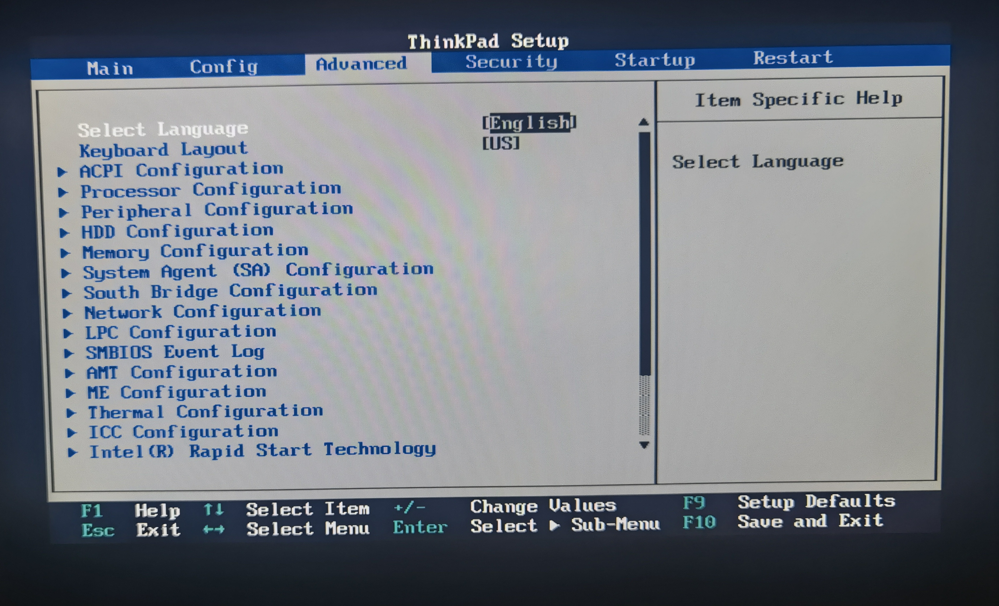

[Read this in English](./patch_BIOS.en.md)

# 指南：仅解锁 BIOS

本教程详细描述了如何使用 [1vyrain](https://github.com/n4ru/1vyrain) 工具解锁您的 ThinkPad BIOS。此流程基本遵循官方指南，但提供了更详尽的步骤和图文说明，以确保操作清晰易懂。

> [!IMPORTANT]
> 本文档仅涵盖解锁 BIOS 的过程。如果您希望在解锁 BIOS 的同时修改 EC 以适配经典键盘，请参阅 [解锁 BIOS 并修改 EC 指南](./patch_BIOS_and_EC.md)。

---

## 一、准备工作

在开始之前，请确保您已准备好以下各项：

1.  **一个 U 盘**：建议容量至少为 4GB。
2.  **操作环境**：一台运行 64 位 Windows 操作系统的电脑。
3.  **IVprep 降级工具**：这是 [1vyrain](https://github.com/n4ru/1vyrain) 官方提供的 BIOS 降级工具。
    -   您可以通过 Git 克隆：`git clone https://github.com/n4ru/IVprep.git`
    -   或者，直接从 GitHub 页面下载 ZIP 压缩包并解压。
    -   为方便起见，本项目也提供了一份拷贝，您可以直接[点击此处](../assets/n4ru-IVprep)。
4.  **BIOS/UEFI 设置**：重启电脑并进入 BIOS/UEFI 设置界面，确认以下选项已正确配置：
    -   **启动模式**：设置为 `UEFI Only`。
        -   路径：`Startup -> UEFI/Legacy Boot -> UEFI Only`
        -   
    -   **固件回滚与更新权限**：确保允许用户更新 BIOS 且已禁用安全回滚保护。
        -   路径：`Security -> UEFI BIOS Update Option`
        -   设置 `Flash BIOS Updating by End-Users` 为 `Enabled`。
        -   设置 `Secure RollBack Prevention` 为 `Disabled`。
        -   
        -   
5.  **创建 1vyrain 启动盘**：
    -   下载 [1vyrain ISO 镜像文件](https://drive.google.com/file/d/1yusq98ja6NmI4G4txKVueFqY_ZEwaZvO/view)（或者此项目中的[备份](../assets/n4ru-1vyrian_iso/)）。
    - 使用 [Rufus](https://rufus.ie/downloads/) 等工具将 ISO 镜像写入 U 盘。
    - > [!Caution]
      >
      > **此操作会清空 U 盘上的所有数据，请提前备份。**
    -   **Rufus 设置流程**：
        
        1.  在“设备”下拉菜单中选择您的 U 盘。
        2.  点击“选择”，加载您下载的 `1vyrain.iso` 文件。
        3.  保持其他选项为默认设置。
        4.  点击“开始”。当弹出“检测到 ISOHybrid 镜像”对话框时，请选择 **以 DD 镜像模式写入**。
        5.  等待写入完成后，即可拔出 U 盘。
        -   

---

## 二、刷写流程

### 第一步：降级 BIOS

1.  在 Windows 系统下，找到您之前准备好的 `IVprep` 文件夹。
2.  以管理员身份运行 `downgrade.bat` 批处理文件。
3.  确保笔记本已连接电源，并根据脚本提示完成操作。计算机会自动重启并执行降级。
4.  降级完成后，再次进入 BIOS/UEFI 设置界面，检查 BIOS 版本号是否已成功降级。确认无误后，继续下一步。

### 第二步：刷写已解锁的 BIOS

1.  将制作好的 1vyrain U 盘插入电脑。
2.  重启电脑，并在开机时按下 **F12** 键，从弹出的启动菜单中选择您的 U 盘启动。
    -   *请确保 BIOS 设置中的 `Startup -> Boot device List F12 Option` 处于 `Enabled` 状态。*
3.  成功从 U 盘启动后，您将看到 1vyrain 的主界面。
    -   
4.  在选项菜单中，输入 `1` 并按回车，选择 "Flash patched BIOS"。
    -   
5.  刷写过程将自动进行，请耐心等待。完成后，系统会自动重启并进入 BIOS/UEFI 设置界面。
6.  如果您在主菜单栏中看到新增的 **`Advanced`** 选项卡，则表示 BIOS 已成功解锁！
    -   

---

## 三、解锁后的主要功能

-   **CPU 超频**：支持对 35xx, 37xx, 38xx, 39xx 系列的 Ivy Bridge CPU 进行超频。
-   **移除硬件白名单**：解除对 WLAN/WWAN 无线网卡的限制，允许安装和使用任意型号的网卡。
-   **高级菜单**：开放完整的 BIOS 高级菜单，提供自定义风扇曲线、调整 TDP（热设计功耗）等深度设置。
-   **Intel ME 管理**：允许通过高级菜单对 Intel 管理引擎（ME）进行“软禁用”。

---

*部分图片来源于[此篇文章](https://zhuanlan.zhihu.com/p/158003472)。*
