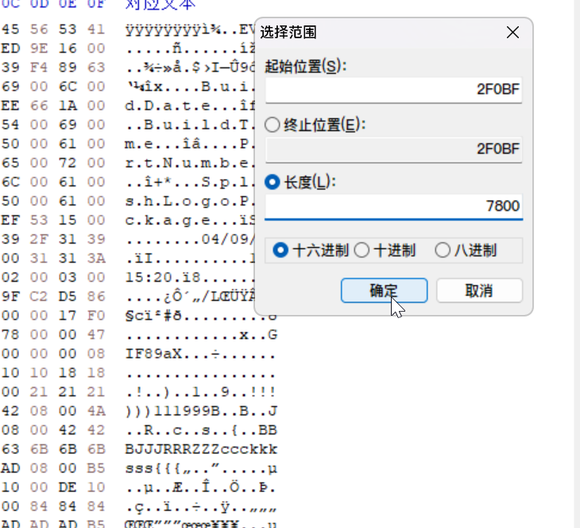
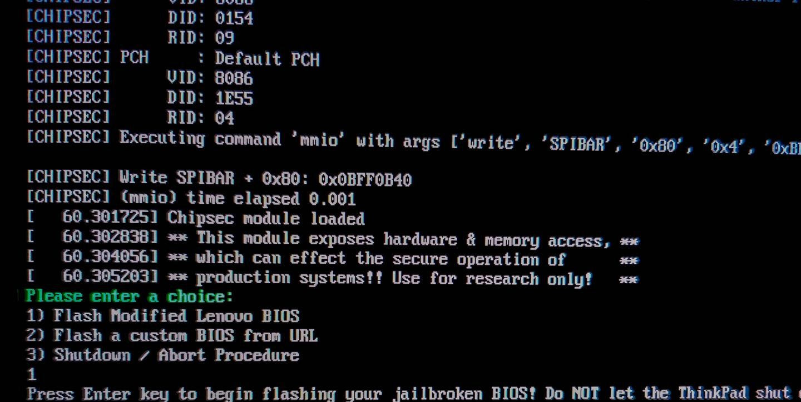

[阅读中文版本](./patch_BIOS_and_EC.md)

# Guide: Unlock BIOS, Modify EC, and Customize Boot Animation

This guide will walk you through the entire process of unlocking the BIOS, modifying the EC (Embedded Controller) to support the classic keyboard, and customizing the boot animation. We will primarily use the `Flash a custom BIOS from URL` feature provided by the 1vyrain project to integrate the boot logo modification directly while flashing the custom BIOS, thereby simplifying the procedure.

---

## I. Creating a Custom BIOS Firmware

### Step 1: Prepare Required Tools and Files

1.  **Windows Environment**: Primarily used for running the official Lenovo BIOS update utility to extract the core firmware file.
2.  **UEFITool and UEFIPatch**:
    -   **IMPORTANT**: As of now, please use version **0.28.0**. Newer versions marked with "NE" (New Engine) may lack the `patch` and `replace` functionalities required for this tutorial.
    -   [Official Download (v0.28.0)](https://github.com/LongSoft/UEFITool/releases/tag/0.28.0)
    -   [Project Backup](../assets/LongSoft-UEFITool/)
3.  **HxD Hex Editor**: Used for modifying the boot animation binary file. You may also use any other hex editor you are familiar with.
    -   [Official Download](https://mh-nexus.de/en/downloads.php?product=HxD20)
    -   [Project Backup](../assets/mh-nexus-HxD/)
4.  **Official Lenovo BIOS Update Utility**: Please download the specific BIOS version compatible with the EC modification for your device model. Official sites may hide older links, but the files are often still available for download.
    -   **T430**: [g1uj48us.exe](https://download.lenovo.com/pccbbs/mobiles/g1uj48us.exe)
    -   **T430s**: [g7uj28us.exe](https://download.lenovo.com/pccbbs/mobiles/g7uj28us.exe)
    -   **T530, T530i**: [g4uj40us.exe](https://download.lenovo.com/pccbbs/mobiles/g4uj40us.exe)
    -   **W530**: [g5uj38us.exe](https://download.lenovo.com/pccbbs/mobiles/g5uj38us.exe)
    -   **X230**: [g2uj31us.exe](https://download.lenovo.com/pccbbs/mobiles/g2uj31us.exe)
    -   **X230t**: [gcuj32us.exe](https://download.lenovo.com/pccbbs/mobiles/gcuj32us.exe)
    -   [Project Backup](../assets/Lenovo-upgrader/)

> [!WARNING]
> The links above are sourced from [hamishcoleman/thinkpad-ec/Descriptions.txt](https://github.com/hamishcoleman/thinkpad-ec/blob/master/Descriptions.txt). If you need to use a different BIOS version, please consult this file. The models listed are all supported by the [thinkpad-ec](https://github.com/hamishcoleman/thinkpad-ec) project.

### Step 2: Extract and Patch the BIOS Firmware

1.  In a Windows system, run the BIOS update utility you downloaded. In the installation wizard, choose a suitable extraction path, and at the final step, **uncheck** the box for `Install ThinkPad BIOS Update Utility now`.

    

3.  Navigate to your chosen extraction directory, find the file with the `.FL1` extension (e.g., `G2ETB5WW/$01G2000.FL1`), copy it to your working directory, and rename it to `BIOS.FL1` for convenience.

    

5.  **Extract the Core BIOS Firmware (Remove the Header)**. This operation strips the header from the `.FL1` file, resulting in a 4MB pure firmware file.
    -   **Windows (PowerShell):**
        ```powershell
        [System.IO.File]::WriteAllBytes('4MB_BIOS.rom', ([System.IO.File]::ReadAllBytes('BIOS.FL1'))[464..(464+4194304-1)])
        ```
    -   **Linux:** ([Source](https://medium.com/@n4ru/1vyrain-an-xx30-thinkpad-jailbreak-fd4bb0bdb654))
        ```bash
        dd if=BIOS.FL1 bs=1 of=4MB_BIOS.rom skip=464 count=4194304
        ```

6.  Upon successful execution, you will have a file named `4MB_BIOS.rom`. This is the original, unmodified BIOS firmware.

7.  **Apply Patches**. Place the `4MB_BIOS.rom` file and the [patches.txt](./patches.txt) file (sourced from [digmorepaka/thinkpad-firmware-patches](https://github.com/digmorepaka/thinkpad-firmware-patches); the version provided in this project is only for the xx30 series) into the same folder as `UEFIPatch`. You can open `patches.txt` beforehand to review and enable or disable specific patches as needed.
    
    

8.  Drag and drop the `4MB_BIOS.rom` file icon onto the `UEFIPatch.exe` application icon. A new file named `4MB_BIOS.rom.patched` will be generated automatically.
    

9.  This newly generated file is the BIOS firmware with the advanced menu unlocked and the whitelist removed. You can rename it to `4MB_BIOS.patched.rom`. If you do not need to customize the boot animation, please skip to the final step of the **Customizing the Boot Animation (Optional)** section, titled **(Optional) TPM Signing**.

### Step 3: Customizing the Boot Animation (Optional)

The method in [1vyrain](https://github.com/n4ru/1vyrain) involves flashing the official upgrader's custom logo first and then dumping the BIOS binary from the device.

This guide's method avoids the need for a second flash by directly modifying the Logo data package within the firmware.

1.  Open the `4MB_BIOS.patched.rom` file using `UEFITool.exe`.
    

2.  **Locate and Extract the Logo Data**.
    -   Press `Ctrl+F` to open the search window, switch to the `Hex pattern` tab, enter the following hex sequence, and search: `17 F0 00 06 0C 00 00 00 00 00 00 00 18 00 78 00 00 47 49 46 38 39 61 58`
        
    -   In the `Messages` window below, double-click the search result. The program will automatically locate the corresponding `Raw section` in the main structure tree.
        
    -   Right-click on this `Raw section`, select `Extract body...`, and save it as `splash.bin`.
        

3.  **Edit the Logo File**.
    -   Open the `splash.bin` file you just exported with `HxD.exe`. Press `Ctrl+F` and search for the text `GIF`. You will find two results, corresponding to the official `LOGO1` and `LOGO2`.
        
    -   Position the cursor to the left of the `G` (hex `47`) in the first `GIF` match. Press `Ctrl+E` to open the "Select block" window, set the length to `7800` (hex), and click OK.
        
    -   Copy the selection (`Ctrl+C`), create a new file (`Ctrl+N`), paste (`Ctrl+V`), and save it as `LOGO1.gif`. You can extract `LOGO2` using the same method.
    -   You can now open and edit these two GIF files with any image editor (like GIMP or Photoshop).

> [!NOTE]
> It is recommended to modify the original images directly rather than creating new files from scratch to ensure better format compatibility.

> [!WARNING]
> The modified images must meet the following criteria, otherwise it may lead to display issues or a failed flash:
> - **Bit Depth**: Must remain 8-bit.
> - **Palette Size**: Must be identical to the original file (LOGO1 is 256 colors, LOGO2 is 32 colors).
> - **File Size**: The size of the modified GIF file must not exceed the original size (`7800` hex bytes). If it is smaller, you must pad the remaining space with `00` to ensure the total length remains unchanged when replacing it back into `splash.bin`.

4.  **Replace and Save the Firmware**.
    -   Write the binary content of your modified `LOGO1.gif` and `LOGO2.gif` back to their corresponding locations in `splash.bin`, and save the result as `splash.custom.bin`.
    -   Open `UEFITool.exe` and `4MB_BIOS.patched.rom` again. Navigate to the same `Raw section` as before, right-click it, and select `Replace body...`.
        
    -   Choose your modified `splash.custom.bin` file to perform the replacement.
    -   Finally, press `Ctrl+S` to save the modified firmware as a new file, `4MB_BIOS.patched.logo.rom`.

5.  **(Optional) TPM Signing**: If you use the TPM (Trusted Platform Module), you will need to sign the final ROM file. Please refer to the instructions in the [thrimbor/thinkpad-uefi-sign](https://github.com/thrimbor/thinkpad-uefi-sign) project to complete this step.

---

## II. Flashing the Custom BIOS

The prerequisites for this step are the same as in the [Guide: Flashing the Unlocked BIOS Only](./patch_BIOS.en.md): you must first complete the BIOS downgrade and create a bootable 1vyrain USB drive.

This process primarily utilizes the `2) Flash a custom BIOS from URL` option provided by 1vyrain.


1.  To provide a URL to 1vyrain, the simplest method is to use another computer and an Ethernet cable to set up a temporary local HTTP server.

    -   **Physical Connection**: Connect your ThinkPad (Computer A) directly to another computer (Computer B) with an Ethernet cable.
    -   **Configure Static IPs**: You can configure the Ethernet settings in your operating system.
        -   **Computer A (To be flashed)**: Configure with an IP like `192.168.1.10` and subnet mask `255.255.255.0`.
        -   **Computer B (File source)**: Configure with an IP like `192.168.1.11` and subnet mask `255.255.255.0`.
    -   **Start the HTTP Server**:
        -   On Computer B, navigate to the directory containing your `4MB_BIOS.patched.logo.rom` file.
        -   Start a simple HTTP server in that directory. For example, using PowerShell, run: `python -m http.server 8000`.
    -   **Begin Flashing**:
        -   Boot Computer A from the 1vyrain USB drive.
        -   In the 1vyrain interface, select option 2. When prompted for a URL, enter:
          `http://192.168.1.11:8000/4MB_BIOS.patched.logo.rom`
        -   Press Enter, and the flashing process will begin automatically.

2.  After the flash is complete, the computer will automatically reboot and enter the BIOS setup screen. Verify that the `Advanced` menu is unlocked and the new boot animation is working.
    

---

## III. Flashing the EC Firmware

Before proceeding with the software steps, please complete the physical keyboard hardware modification. Detailed hardware modding steps (including pin masking) can be found in guides like the [ThinkWiki Classic Keyboard Mod guide](https://www.thinkwiki.org/wiki/Install_Classic_Keyboard_on_xx30_Series_ThinkPads) or by watching tutorials on video platforms.

The guide in the [thinkpad-ec](https://github.com/hamishcoleman/thinkpad-ec) project is already very comprehensive. The following are detailed steps compiled and summarized by `gemini-2.5-pro`, but the original project's guide should always be considered the primary source.

#### **Phase 1: Prepare the Linux Environment**

*   **Operating System**: This must be done on a native Linux system (WSL is not supported). You can use a Live USB system, such as Ubuntu.
*   **Install Dependencies**:
    *   **Debian / Ubuntu**: `sudo apt-get update && sudo apt-get install make git`
    *   **Fedora**: `sudo dnf install git mtools openssl-devel && sudo dnf group install "C Development Tools and Libraries"`
*   **Download Project Files**:
    ```bash
    cd ~
    git clone https://github.com/hamishcoleman/thinkpad-ec
    cd ~/thinkpad-ec
    ```
*   **Install Build Dependencies (Debian/Ubuntu only)**: `sudo make build-deps`

#### **Phase 2: Build the EC Patch Boot Disk**

1.  **Build the Image**: Run the `make` command, specifying your laptop model. This will automatically download the official firmware and apply the patch.
    ```bash
    # Example for X230
    make patched.x230.img
    ```
2.  **Prepare a USB Drive**: Insert a USB drive that **can be completely erased**.
3.  **Identify the USB Drive**: Run `lsblk -d -o NAME,SIZE,LABEL` to find your USB drive's device name (e.g., `/dev/sdb`). **Double- and triple-check this, as choosing the wrong device will result in data loss!**
4.  **Write the Image**: Use the `dd` command to write the image to the USB drive. Replace `sdx` with your actual device name.
    ```bash
    # Example for X230 and /dev/sdx
    sudo dd if=patched.x230.img of=/dev/sdx bs=4M status=progress conv=fsync
    ```

#### **Phase 3: Boot from the USB and Flash the EC**

1.  **Configure BIOS**: Reboot your ThinkPad, enter the BIOS setup, and change the boot mode to **`Legacy Only`**.
2.  **Boot from USB**: Boot from the EC patch USB drive you just created.
3.  **First-Stage Flash**:
    -   After the system boots, it will display patch information, and then the new EC firmware is automatically "staged" within the BIOS.
    -   Once this process is complete, the computer will **reboot automatically**.
4.  **Second-Stage Flash**:
    -   After the reboot, the BIOS will detect the staged EC update.
    -   If the power and battery conditions are met, the screen will explicitly display **"Flashing EC"** or a similar message. **Seeing this screen confirms that the EC is actually being flashed.**
    -   After the flash completes, the system will boot normally. Your classic keyboard should now be working perfectly.

---

## IV. Summary

The entire process can be summarized in three core stages:

1.  **Prepare the Custom BIOS Firmware**:
    -   Download a specific version of the BIOS update utility from the Lenovo website.
    -   Run the utility in Windows to extract the core `.FL1` firmware file.
    -   Use a command-line tool to strip the header, resulting in `4MB_BIOS.rom`.
    -   Use the `UEFIPatch` tool to apply the unlock patches to the ROM.
    -   (Optional) Use `UEFITool` and `HxD` to extract, modify, and replace the boot animation files within the firmware.

2.  **Flash the Custom BIOS**:
    -   Ensure you have completed the BIOS downgrade as described in the [other guide](./patch_BIOS.en.md).
    -   Create a bootable 1vyrain USB drive and boot from it.
    -   Select the `Flash from URL` option, using another computer and an Ethernet cable to set up a temporary HTTP server, and flash your customized ROM file to the ThinkPad.

3.  **Flash the EC Firmware**:
    -   In a Linux environment, use the scripts from the `thinkpad-ec` project to build a bootable USB drive containing the keyboard patch for your specific model.
    -   Switch the ThinkPad's boot mode to `Legacy Only`.
    -   Boot from the EC patch USB drive and allow the program to automatically complete the two-stage EC firmware flash.
