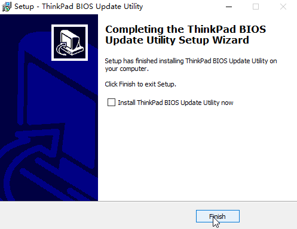
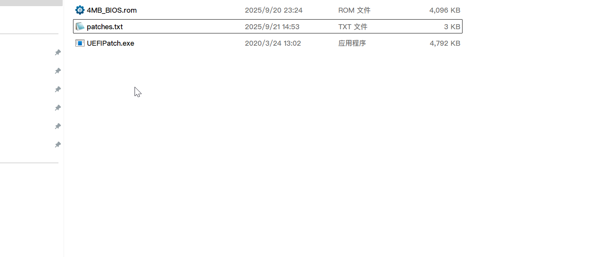
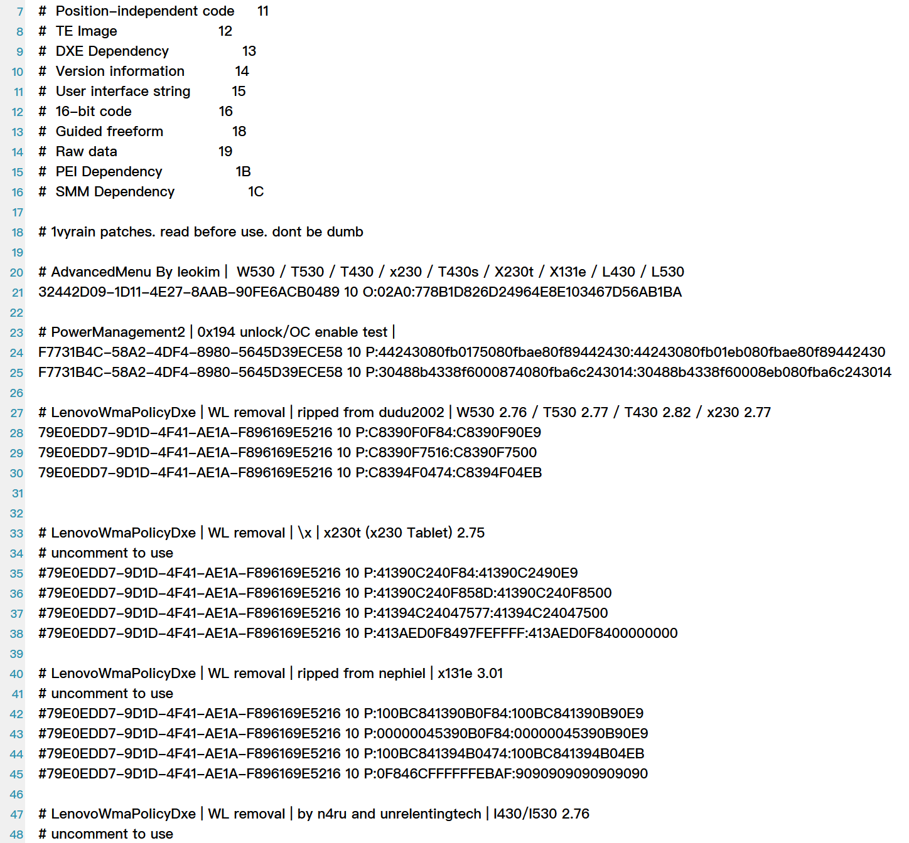
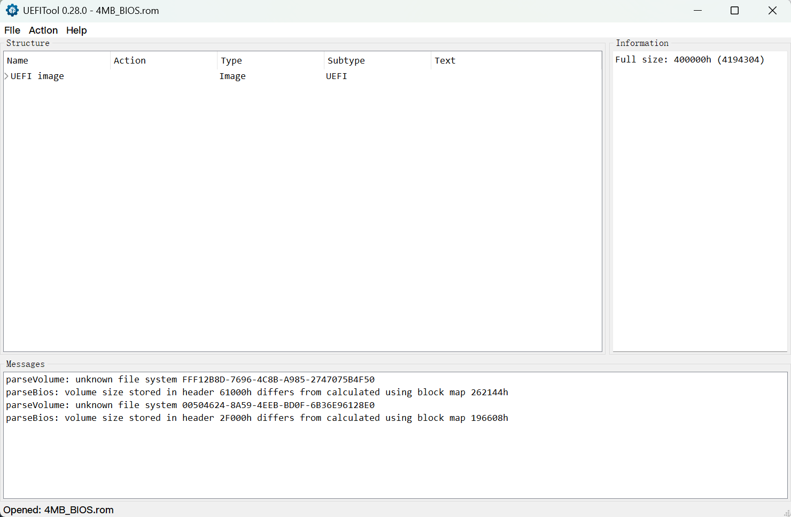
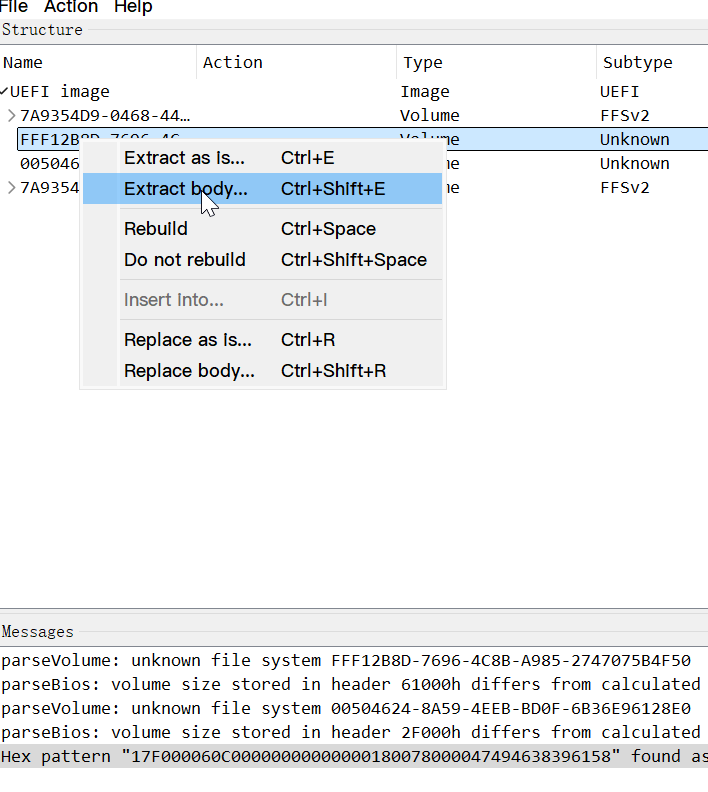
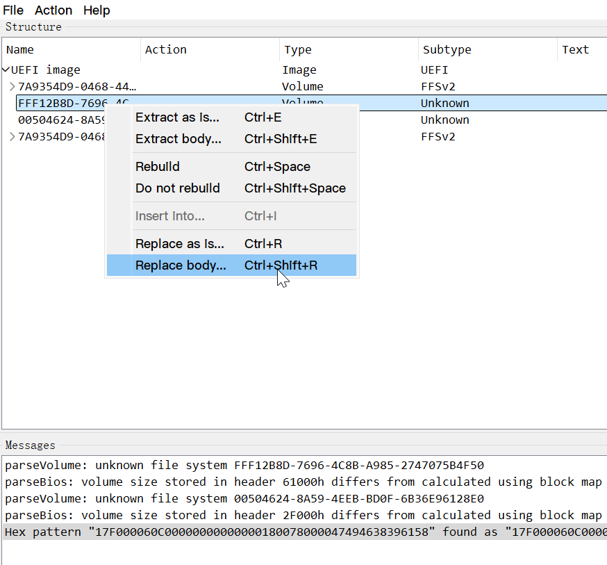

[阅读中文版本](./patch_BIOS_and_EC.md)

# Guide: Unlocking the BIOS, Patching the EC, and Customizing the Boot Logo

This guide will walk you through the complete process of unlocking your BIOS, patching the Embedded Controller (EC) for classic keyboard compatibility, and customizing the boot logo. The core of this method utilizes the `Flash a custom BIOS from URL` feature from the 1vyrain project, which allows us to integrate the boot logo modification directly into the custom BIOS, simplifying the overall procedure.

---

## Part I: Creating a Custom BIOS Firmware

### Step 1: Preparing Tools and Files

1.  **Windows Environment**: Required to run the official Lenovo BIOS updater and extract the core firmware file.
2.  **UEFITool and UEFIPatch**:
    -   **Important**: As of now, you must use version **0.28.0**. Newer versions marked with "NE" (New Engine) may lack the patching and replacement functionality required for this tutorial.
    -   [Official Download (v0.28.0)](https://github.com/LongSoft/UEFITool/releases/tag/0.28.0)
    -   [Project Mirror](../assets/LongSoft-UEFITool/)
3.  **HxD Hex Editor**: Used to modify the boot logo's binary data. You may use any other hex editor you are comfortable with.
    -   [Official Download](https://mh-nexus.de/en/downloads.php?product=HxD20)
    -   [Project Mirror](../assets/mh-nexus-HxD/)
4.  **Official Lenovo BIOS Updater**: Download the specific BIOS version for your model that is compatible with the EC patch. While Lenovo may hide direct links to older versions on their website, the download URLs often remain active.
    -   **T430**: [g1uj48us.exe](https://download.lenovo.com/pccbbs/mobiles/g1uj48us.exe)
    -   **T430s**: [g7uj28us.exe](https://download.lenovo.com/pccbbs/mobiles/g7uj28us.exe)
    -   **T530, T530i**: [g4uj40us.exe](https://download.lenovo.com/pccbbs/mobiles/g4uj40us.exe)
    -   **W530**: [g5uj38us.exe](https://download.lenovo.com/pccbbs/mobiles/g5uj38us.exe)
    -   **X230**: [g2uj31us.exe](https://download.lenovo.com/pccbbs/mobiles/g2uj31us.exe)
    -   **X230t**: [gcuj32us.exe](https://download.lenovo.com/pccbbs/mobiles/gcuj32us.exe)
    -   [Project Mirror](../assets/Lenovo-upgrader/)

> [!WARNING]
> The links above are sourced from [hamishcoleman/thinkpad-ec/Descriptions.txt](https://github.com/hamishcoleman/thinkpad-ec/blob/master/Descriptions.txt). Please consult this file if you need to use a different BIOS version. The models listed are all supported by the [thinkpad-ec](https://github.com/hamishcoleman/thinkpad-ec) project.

### Step 2: Extracting and Patching the BIOS Firmware

1.  On a Windows system, run the downloaded BIOS updater executable. In the setup wizard, choose a location to extract the files, and at the final step, **uncheck** the box for `Install ThinkPad BIOS Update Utility now`.
    

2.  Navigate to the directory where you extracted the files. Locate the file with the `.FL1` extension (e.g., `G2ETB5WW/$01G2000.FL1`), copy it to your working directory, and rename it to `BIOS.FL1` for convenience.
    

3.  **Extract the Core BIOS Firmware (Remove Header)**. This command strips the header from the `.FL1` file, leaving a 4MB pure firmware image.
    -   **Windows (PowerShell):**
        ```powershell
        [System.IO.File]::WriteAllBytes('4MB_BIOS.rom', ([System.IO.File]::ReadAllBytes('BIOS.FL1'))[464..(464+4194304-1)])
        ```
    -   **Linux:** ([Source](https://medium.com/@n4ru/1vyrain-an-xx30-thinkpad-jailbreak-fd4bb0bdb654))
        ```bash
        dd if=BIOS.FL1 bs=1 of=4MB_BIOS.rom skip=464 count=4194304
        ```

4.  After running the command, you will have a file named `4MB_BIOS.rom`. This is the unmodified, stock BIOS firmware.

5.  **Apply Patches**. Place your `4MB_BIOS.rom` file and the provided [patches.txt](./patches.txt) file in the same directory as `UEFIPatch.exe`. (The `patches.txt` in this project is sourced from [digmorepaka/thinkpad-firmware-patches](https://github.com/digmorepaka/thinkpad-firmware-patches) and is configured for xx30-series models). You can open `patches.txt` to review and manage the patches as needed.
    
    

6.  Click and **drag** the `4MB_BIOS.rom` file icon onto the `UEFIPatch.exe` application icon, then release the mouse button. If successful, a new file named `4MB_BIOS.rom.patched` will be generated.
    

7.  This new file is your patched BIOS firmware with the advanced menu unlocked and whitelists removed. You can rename it to `4MB_BIOS.patched.rom`. If you do not wish to customize the boot logo, you may now skip to the final step of the next section, **(Optional) TPM Signing**.

### Step 3: Customizing the Boot Logo (Optional)

This method avoids a second flash by directly modifying the logo data package within the firmware.

1.  Open your `4MB_BIOS.patched.rom` file with `UEFITool.exe`.
    

2.  **Locate and Extract the Logo Data**.
    -   Press `Ctrl+F` to open the search dialog, switch to the `Hex pattern` tab, and search for the following pattern: `17 F0 00 06 0C 00 00 00 00 00 00 00 18 00 78 00 00 47 49 46 38 39 61 58`
        
    -   Double-click the result in the `Messages` window below. The main structure view will automatically jump to the corresponding `Raw section`.
        
    -   Right-click on this `Raw section`, select `Extract body...`, and save the file as `splash.bin`.
        

3.  **Edit the Logo File**.
    -   Open the extracted `splash.bin` file with `HxD.exe`. Press `Ctrl+F` and search for the text string `GIF`. You should find two occurrences, which correspond to the official `LOGO1` and `LOGO2`.
        
    -   Place your cursor to the left of the `G` (hex `47`) of the first `GIF` result. Press `Ctrl+E` to open the "Select block" dialog, set the length to `7800` (hex), and click OK.
        
    -   Copy the selection (`Ctrl+C`), create a new file (`Ctrl+N`), paste the data (`Ctrl+V`), and save it as `LOGO1.gif`. You can repeat this process for the second logo (`LOGO2`).
    -   You can now open and edit these `.gif` files using an image editor like GIMP or Photoshop.

> [!NOTE]
> It is highly recommended to edit the original images rather than creating new ones from scratch to ensure maximum format compatibility.

> [!WARNING]
> The modified images must adhere to the following constraints to prevent display issues or a failed flash:
> - **Bit Depth**: Must remain 8-bit.
> - **Palette Size**: Must match the original file (LOGO1 uses 256 colors, LOGO2 uses 32 colors).
> - **File Size**: The modified GIF's binary size must not exceed the original's size (`7800` hex bytes). If it is smaller, you must pad the end with `00` bytes to maintain the original total length before replacing it in `splash.bin`.

4.  **Replace and Save the Firmware**.
    -   Write the binary content of your modified `LOGO1.gif` and `LOGO2.gif` back into their respective positions within a copy of `splash.bin`, and save this new file as `splash.custom.bin`.
    -   Re-open `4MB_BIOS.patched.rom` in `UEFITool.exe`. Navigate back to the same `Raw section`, right-click it, and select `Replace body...`.
        
    -   Choose your modified `splash.custom.bin` file to perform the replacement.
    -   Finally, press `Ctrl+S` to save the final modified firmware as `4MB_BIOS.patched.logo.rom`.

5.  **(Optional) TPM Signing**: If you use the Trusted Platform Module (TPM), you must sign the final ROM file. Please follow the instructions at the [thrimbor/thinkpad-uefi-sign](https://github.com/thrimbor/thinkpad-uefi-sign) project to complete this step.

---

## Part II: Flashing the Custom BIOS

The prerequisites for this step are the same as in the [BIOS-Only Unlock Guide](./patch_bios.md): you must first downgrade your BIOS and have a bootable 1vyrain USB drive ready. This process utilizes the `2) Flash a custom BIOS from URL` option.


1.  To provide a URL to 1vyrain, the easiest method is to set up a temporary local network and HTTP server using a second computer and an Ethernet cable.

    -   **Physical Connection**: Connect your ThinkPad (Computer A) directly to the second computer (Computer B) using an Ethernet cable.
    -   **Configure Static IP Addresses**: You can pre-configure the Ethernet adapter settings in Windows.
        -   **Computer A (Target)**: Set IP to `192.168.1.10`, Subnet mask to `255.255.255.0`.
        -   **Computer B (Host)**: Set IP to `192.168.1.11`, Subnet mask to `255.255.255.0`.
    -   **Start the HTTP Server**:
        -   On Computer B, navigate to the folder containing your `4MB_BIOS.patched.logo.rom` file.
        -   Start a simple HTTP server in that directory. For example, open PowerShell and run: `python -m http.server 8000`
    -   **Begin Flashing**:
        -   Boot Computer A from the 1vyrain USB drive.
        -   In the 1vyrain menu, select option `2`. When prompted for a URL, enter:
          `http://192.168.1.11:8000/4MB_BIOS.patched.logo.rom`
        -   Press Enter. The flashing process will begin automatically.

2.  After the flash is complete, the computer will reboot and enter the BIOS setup screen. Verify that the new `Advanced` menu is present and that your custom boot logo appears on startup.
    

---

## Part III: Flashing the EC Firmware

Before proceeding with the software steps, please complete the physical keyboard hardware swap. For detailed hardware modification instructions (including taping over pins), refer to the [ThinkWiki Guide for Installing a Classic Keyboard](https://www.thinkwiki.org/wiki/Install_Classic_Keyboard_on_xx30_Series_ThinkPads) or search for video tutorials.

The following steps are a summary of the guide from the excellent [thinkpad-ec](https://github.com/hamishcoleman/thinkpad-ec) project. For any discrepancies, the original project's guide is the authoritative source.

#### **Stage 1: Preparing the Linux Environment**

*   **Operating System**: You must use a native Linux environment (WSL is not supported). A live USB system like Ubuntu will work.
*   **Install Dependencies**:
    *   **Debian / Ubuntu**: `sudo apt-get update && sudo apt-get install make git`
    *   **Fedora**: `sudo dnf install git mtools openssl-devel && sudo dnf group install "C Development Tools and Libraries"`
*   **Download the Project Files**:
    ```bash
    cd ~
    git clone https://github.com/hamishcoleman/thinkpad-ec
    cd ~/thinkpad-ec
    ```
*   **Install Build Dependencies (Debian/Ubuntu only)**: `sudo make build-deps`

#### **Stage 2: Building the Patched EC Bootable Media**

1.  **Build the Image**: Run the `make` command, specifying your laptop model. This will automatically download the stock firmware and apply the keyboard patch.
    ```bash
    # Example for an X230
    make patched.x230.img
    ```
2.  **Prepare a USB Drive**: Insert a USB drive that you are willing to **completely erase**.
3.  **Identify the USB Drive**: Run `lsblk -d -o NAME,SIZE,LABEL` to find the device name of your USB drive (e.g., `/dev/sdb`). **Double-check this carefully, as choosing the wrong device will result in data loss!**
4.  **Write the Image**: Use the `dd` command to write the image to the drive. Replace `sdx` with the correct device name you identified.
    ```bash
    # Example for an X230 and device /dev/sdx
    sudo dd if=patched.x230.img of=/dev/sdx bs=4M status=progress conv=fsync
    ```

#### **Stage 3: Booting from the USB Drive and Flashing the EC**

1.  **Configure BIOS**: Reboot your ThinkPad, enter the BIOS setup, and change the boot mode to **`Legacy Only`**.
2.  **Boot from USB**: Boot from the EC patch USB drive you just created.
3.  **First Stage Flash**:
    -   The system will boot, display information about the patch, and then "stage" the new EC firmware for the BIOS to install.
    -   After this is done, the computer will **reboot automatically**.
4.  **Second Stage Flash**:
    -   As the computer reboots, the BIOS will detect the staged EC update.
    -   If all safety conditions are met (e.g., AC power connected, battery present), you will see an explicit message on screen, such as **"Flashing EC"**. **Seeing this screen is the only confirmation that the EC is actually being flashed.**
    -   Once complete, the system will boot normally into your OS, and the classic keyboard should now be fully functional.

---

## Part IV: Summary

The entire process can be summarized in three main phases:

1.  **Prepare the Custom BIOS Firmware**:
    -   Download a specific, EC-patch-compatible BIOS updater from Lenovo.
    -   Extract the `.FL1` core firmware file on a Windows machine.
    -   Use a command-line tool to strip the file header, resulting in `4MB_BIOS.rom`.
    -   Use `UEFIPatch` to apply the unlock patches to the ROM.
    -   (Optional) Use `UEFITool` and `HxD` to extract, modify, and replace the boot logo images within the firmware.

2.  **Flash the Custom BIOS**:
    -   Ensure your ThinkPad's BIOS has been downgraded as per the [separate guide](./patch_bios.md).
    -   Boot from a 1vyrain USB drive.
    -   Select the `Flash from URL` option and use a second computer to host your custom ROM file over a direct Ethernet connection.

3.  **Flash the EC Firmware**:
    -   In a Linux environment, use the `thinkpad-ec` project scripts to build a bootable USB drive containing the keyboard patch for your specific model.
    -   Switch the ThinkPad's boot mode to `Legacy Only`.
    -   Boot from the patched EC USB drive and allow the automated two-stage flashing process to complete.