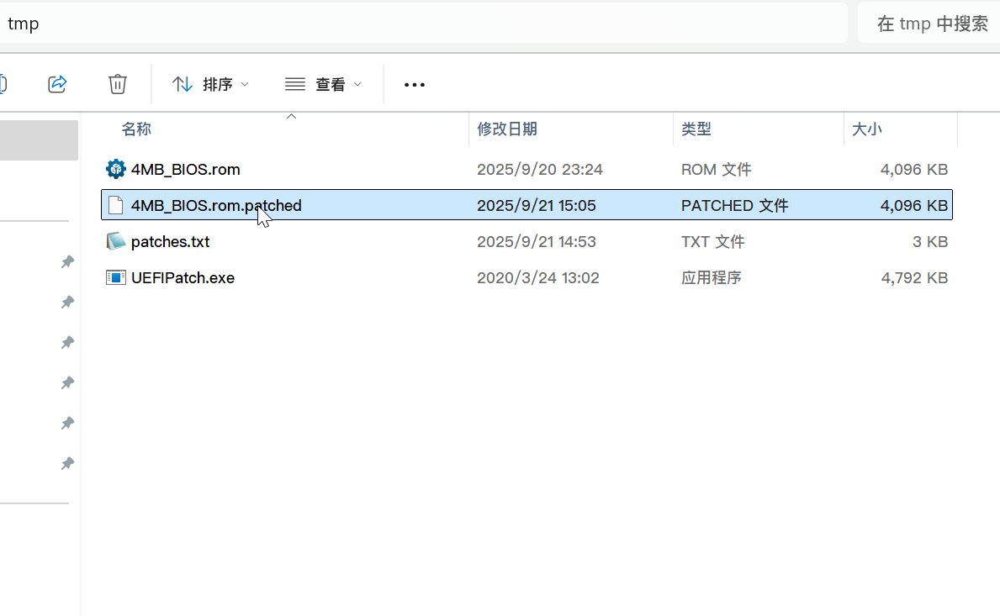

[Read this in English](./patch_BIOS_and_EC.en.md)

# 指南：解锁 BIOS、修改 EC 并自定义开机动画

本指南将引导您完成解锁 BIOS、修改 EC（Embedded Controller）以适配经典键盘，以及自定义开机动画的全过程。我们主要利用 1vyrain 项目提供的 `Flash a custom BIOS from URL` 功能，在刷写自定义 BIOS 的同时，直接集成开机画面的修改，从而简化操作步骤。

---

## 一、制作自定义 BIOS 固件

### 第一步：准备所需工具与文件

1.  **Windows 环境**: 主要用于执行联想官方的 BIOS 升级程序，以提取核心固件文件。
2.  **UEFITool 和 UEFIPatch**:
    -   **重要提示**: 截至目前，请使用 **0.28.0** 版本。带有 "NE" (New Engine) 标识的新版本可能缺少本教程所需的 patch 和 replace 功能。
    -   [官方下载地址 (v0.28.0)](https://github.com/LongSoft/UEFITool/releases/tag/0.28.0)
    -   [本项目备份](../assets/LongSoft-UEFITool/)
3.  **HxD 十六进制编辑器**: 用于后续修改开机动画的二进制文件。您也可以使用其他熟悉的十六进制编辑器。
    -   [官方下载地址](https://mh-nexus.de/en/downloads.php?product=HxD20)
    -   [本项目备份](../assets/mh-nexus-HxD/)
4.  **联想官方 BIOS 升级程序**: 请根据您的设备型号，下载与 EC 修改兼容的特定版本 BIOS。官网可能隐藏了旧版链接，但文件依然可以下载。
    -   **T430**: [g1uj48us.exe](https://download.lenovo.com/pccbbs/mobiles/g1uj48us.exe)
    -   **T430s**: [g7uj28us.exe](https://download.lenovo.com/pccbbs/mobiles/g7uj28us.exe)
    -   **T530, T530i**: [g4uj40us.exe](https://download.lenovo.com/pccbbs/mobiles/g4uj40us.exe)
    -   **W530**: [g5uj38us.exe](https://download.lenovo.com/pccbbs/mobiles/g5uj38us.exe)
    -   **X230**: [g2uj31us.exe](https://download.lenovo.com/pccbbs/mobiles/g2uj31us.exe)
    -   **X230t**: [gcuj32us.exe](https://download.lenovo.com/pccbbs/mobiles/gcuj32us.exe)
    -   [本项目备份](../assets/Lenovo-upgrader/)

> [!WARNING]
> 以上链接源自 [hamishcoleman/thinkpad-ec/Descriptions.txt](https://github.com/hamishcoleman/thinkpad-ec/blob/master/Descriptions.txt)。如果您需要使用其他 BIOS 版本，请查阅此文件。列表中的型号均为 [thinkpad-ec](https://github.com/hamishcoleman/thinkpad-ec) 项目支持的设备。

### 第二步：提取并修补 BIOS 固件

1.  在 Windows 系统下，运行您下载的 BIOS 升级程序。在安装向导中，选择一个合适的解压路径，并在最后一步**取消勾选** `Install ThinkPad BIOS Update Utility now`。
    

2.  进入您选择的解压目录，找到后缀为 `.FL1` 的文件（例如 `G2ETB5WW/$01G2000.FL1`），将其复制到您的工作目录下，并可重命名为 `BIOS.FL1` 以方便操作。
    

3.  **提取 BIOS 核心固件 (移除文件头)**。此操作将从 `.FL1` 文件中剥离掉文件头，得到一个 4MB 大小的纯固件文件。
    -   **Windows (PowerShell):**
        ```powershell
        [System.IO.File]::WriteAllBytes('4MB_BIOS.rom', ([System.IO.File]::ReadAllBytes('BIOS.FL1'))[464..(464+4194304-1)])
        ```
    -   **Linux:** ([来源](https://medium.com/@n4ru/1vyrain-an-xx30-thinkpad-jailbreak-fd4bb0bdb654))
        ```bash
        dd if=BIOS.FL1 bs=1 of=4MB_BIOS.rom skip=464 count=4194304
        ```

4.  执行成功后，您将得到一个名为 `4MB_BIOS.rom` 的文件。这是未经任何修改的原始 BIOS 固件。

5.  **应用补丁**。将 `4MB_BIOS.rom` 文件和 [patches.txt](./patches.txt) 文件（源自 [digmorepaka/thinkpad-firmware-patches](https://github.com/digmorepaka/thinkpad-firmware-patches)，本项目中提供的版本仅适用于 xx30 系列）放置在 `UEFIPatch` 所在的同一个文件夹下。您可以先打开 `patches.txt` 查看并按需启用或禁用特定补丁。
    
    

6.  用鼠标左键按住 `4MB_BIOS.rom` 文件图标，将其**拖拽**到 `UEFIPatch.exe` 的程序图标上，然后松开鼠标。操作成功后，会自动生成一个名为 `4MB_BIOS.rom.patched` 的新文件。
    

7.  这个新生成的文件就是解锁了高级菜单并移除了白名单的 BIOS 固件。您可以将其重命名为 `4MB_BIOS.patched.rom`。如果您不需要修改开机动画，请直接跳转到 **自定义开机动画 (可选)** 部分的最后一步**(可选) TPM 签名**部分。

### 第三步：自定义开机动画 (可选)

此方法通过直接修改固件内的 Logo 数据包来实现，避免了二次刷写的麻烦。

1.  使用 `UEFITool.exe` 打开 `4MB_BIOS.patched.rom` 文件。
    

2.  **定位并提取 Logo 数据**。
    -   按下 `Ctrl+F` 打开搜索窗口，切换到 `Hex pattern` 选项卡，输入以下十六进制序列并搜索：`17 F0 00 06 0C 00 00 00 00 00 00 00 18 00 78 00 00 47 49 46 38 39 61 58`
        
    -   在下方的 `Messages` 窗口中双击搜索结果，程序会自动在主结构树中定位到对应的 `Raw section`。
        
    -   右键点击这个 `Raw section`，选择 `Extract body...`，将其保存为 `splash.bin`。
        

3.  **编辑 Logo 文件**。
    -   使用 `HxD.exe` 打开刚刚导出的 `splash.bin` 文件。按下 `Ctrl+F` 搜索文本 `GIF`。您会找到两个结果，分别对应官方的 `LOGO1` 和 `LOGO2`。
        
    -   将光标定位到第一个 `GIF` 的 `G` (十六进制 `47`) 字符左侧，按下 `Ctrl+E` 打开选择范围窗口，设置长度为 `7800` (十六进制)，点击确定。
        
    -   复制选中部分 (`Ctrl+C`)，新建一个文件 (`Ctrl+N`)，粘贴 (`Ctrl+V`) 并保存为 `LOGO1.gif`。用同样的方法可以提取 `LOGO2`。
    -   现在您可以使用任何图像编辑器（如 GIMP, Photoshop）打开并修改这两个 GIF 文件了。

> [!NOTE]
> 建议直接在原始图片上修改，而不是创建一个全新的文件，这样可以更好地保证格式兼容性。

> [!WARNING]
> 修改后的图片必须满足以下条件，否则可能导致显示异常或刷写失败：
> - **位深度**: 必须保持为 8-bit。
> - **调色盘大小**: 必须与原始文件一致（LOGO1 为 256 色，LOGO2 为 32 色）。
> - **文件大小**: 修改后的 GIF 文件大小不能超过原始文件大小 (`7800` 十六进制字节)。如果小于原始大小，需要用 `00` 填充剩余部分，以确保替换回 `splash.bin` 时总长度不变。

4.  **替换并保存固件**。
    -   将修改后的 `LOGO1.gif` 和 `LOGO2.gif` 的二进制内容写回您 `splash.bin` 的对应位置，保存为 `splash.custom.bin`。
    -   再次打开 `UEFITool.exe` 和 `4MB_BIOS.patched.rom`。定位到之前的 `Raw section`，右键点击选择 `Replace body...`。
        
    -   选择您修改好的 `splash.custom.bin` 文件进行替换。
    -   最后，按下 `Ctrl+S` 将修改后的固件另存为 `4MB_BIOS.patched.logo.rom`。

5.  **(可选) TPM 签名**: 如果您使用 TPM (可信平台模块)，您需要对最终的 ROM 文件进行签名。请参考 [thrimbor/thinkpad-uefi-sign](https://github.com/thrimbor/thinkpad-uefi-sign) 项目的说明完成此步骤。

---

## 二、刷写自定义 BIOS

此步骤的前提与 [仅解锁 BIOS 指南](./patch_bios.md) 相同：您需要先完成 BIOS 降级，并制作好 1vyrain 的启动 U 盘。

主要是利用了1vyrain提供的 `2) Flash a custom BIOS from URL`选项实现。


1.  为了向 1vyrain 提供一个 URL，最简单的方法是使用另一台电脑和一根网线搭建一个临时的局域网 HTTP 服务器。

    -   **物理连接**: 用网线将您的 ThinkPad (电脑 A) 和另一台电脑 (电脑 B) 直接连接。
    -   **配置静态 IP**: 可在 Windows系统下的网络设置中配置以太网, 
        -   **电脑 A (待刷机)**: 配置比如 IP: `192.168.1.10`, 子网掩码: `255.255.255.0`
        -   **电脑 B (文件源)**: 配置比如 IP: `192.168.1.11`，子网掩码: `255.255.255.0`。
    -   **启动 HTTP 服务器**:
        -   在电脑 B 上，进入存放 `4MB_BIOS.patched.logo.rom` 文件的目录。
        -   在该目录启动一个简单的 HTTP 服务器。例如，使用 powershell执行 `python -m http.server 8000`
    -   **开始刷写**:
        -   电脑A从1vyrain系统盘启动
        -   在1vyrain 界面中选择输入2，当提示输入 URL 时，输入：
          `http://192.168.1.11:8000/4MB_BIOS.patched.logo.rom`
        -   按下回车，刷写过程将自动开始。

2.  刷写完成后，电脑会自动重启并进入 BIOS 设置界面。检查 `Advanced` 菜单和新的开机动画是否都已生效。
    

---

## 三、刷写 EC 固件

在进行软件操作前，请先完成键盘的硬件修改。详细的硬件改装步骤（包括屏蔽针脚等）可以参考 [ThinkWiki 的经典键盘改装指南](https://www.thinkwiki.org/wiki/Install_Classic_Keyboard_on_xx30_Series_ThinkPads)或者一些视频网站上的实际操作内容。

 [thinkpad-ec](https://github.com/hamishcoleman/thinkpad-ec) 项目中的引导已经很完善了，以下是经过`gemini-2.5-pro`整理和总结的详细步骤, 一切以原项目中引导为主。

#### **第一阶段：准备 Linux 环境**

*   **操作系统**: 必须在真实的 Linux 系统下操作（不支持 WSL）。您可以使用 Live USB 系统，如 Ubuntu。
*   **安装依赖**:
    *   **Debian / Ubuntu**: `sudo apt-get update && sudo apt-get install make git`
    *   **Fedora**: `sudo dnf install git mtools openssl-devel && sudo dnf group install "C Development Tools and Libraries"`
*   **下载项目文件**:
    ```bash
    cd ~
    git clone https://github.com/hamishcoleman/thinkpad-ec
    cd ~/thinkpad-ec
    ```
*   **安装编译依赖 (仅 Debian/Ubuntu)**: `sudo make build-deps`

#### **第二阶段：构建 EC 补丁启动盘**

1.  **构建镜像**: 运行 `make` 命令并指定您的笔记本型号。这会自动下载官方固件并打上补丁。
    ```bash
    # 以 X230 为例
    make patched.x230.img
    ```
2.  **准备 U 盘**: 插入一个**可以被完全清空**的 U 盘。
3.  **识别 U 盘**: 运行 `lsblk -d -o NAME,SIZE,LABEL` 找到您的 U 盘设备名 (例如 `/dev/sdb`)。**务必再三确认，选错会导致数据丢失！**
4.  **写入镜像**: 使用 `dd` 命令将镜像写入 U 盘。请将 `sdx` 替换为您的真实设备名。
    ```bash
    # 再次以 X230 和 /dev/sdx 为例
    sudo dd if=patched.x230.img of=/dev/sdx bs=4M status=progress conv=fsync
    ```

#### **第三阶段：从 U 盘启动并刷新 EC**

1.  **设置 BIOS**: 重启 ThinkPad，进入 BIOS 设置，将启动模式改为 **`Legacy Only`**。
2.  **U 盘启动**: 从您刚刚制作的 EC 补丁 U 盘启动。
3.  **第一阶段刷新**:
    -   系统启动后，会显示补丁信息，然后自动将新的 EC 固件“暂存”到 BIOS 中。
    -   此过程完成后，电脑会**自动重启**。
4.  **第二阶段刷新**:
    -   电脑重启后，BIOS 会检测到暂存的 EC 更新。
    -   如果电源、电池等条件满足，屏幕上会明确显示 **"Flashing EC"** 或类似信息。**看到这个画面才代表 EC 正在被真正刷新。**
    -   刷新完成后，系统会正常启动。此时，您的经典键盘应该已经可以完美工作了。

---

## 四、总结

整个流程可以概括为三个核心阶段：

1.  **准备自定义 BIOS 固件**:
    -   从联想官网下载特定版本的 BIOS 升级程序。
    -   在 Windows 下运行程序以解压出 `.FL1` 核心固件文件。
    -   使用命令行工具移除文件头，得到 `4MB_BIOS.rom`。
    -   使用 `UEFIPatch` 工具为 ROM 打上解锁补丁。
    -   (可选) 使用 `UEFITool` 和 `HxD` 提取、修改并替换固件中的开机动画文件。

2.  **刷写自定义 BIOS**:
    -   确保已按照 [另一份指南](./patch_bios.md) 完成了 BIOS 降级。
    -   制作 1vyrain 启动 U 盘，并从其启动。
    -   选择 `Flash from URL` 选项，利用另一台电脑和网线搭建临时 HTTP 服务，将自定义好的 ROM 文件刷入 ThinkPad。

3.  **刷写 EC 固件**:
    -   在 Linux 环境下，使用 `thinkpad-ec` 项目的脚本，为您的设备型号构建一个包含键盘补丁的启动 U 盘。
    -   将 ThinkPad 的启动模式切换到 `Legacy Only`。
    -   从制作好的 EC 补丁 U 盘启动，让程序自动完成两阶段的 EC 固件刷新。